# Casos de Teste - EMoov

Este documento apresenta os casos de teste manuais executados na API do sistema EMoov utilizando o Thunder Client.

---

## Resumo dos Testes

| Módulo       | Quantidade |
| ------------ | ---------: |
| Login        |          2 |
| Funcionários |          3 |
| Motoristas   |          3 |
| Veículos     |          3 |
| Corridas     |          1 |
| **Total**    |     **12** |

---

# 1. Login

## CT-LOGIN-001 - Login com credenciais válidas

**Objetivo:** Validar que o sistema permite autenticação com usuário e senha corretos.

**Método:** POST
**Endpoint:** `/auth/login`

**Resultado esperado:**
Retornar status `200 OK` e token de autenticação.

**Resultado obtido:**
Status `200 OK` e token retornado com sucesso.

**Status:** ✅ Aprovado

### Evidência

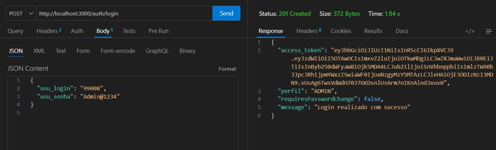

---

## CT-LOGIN-002 - Login com senha inválida

**Objetivo:** Validar que o sistema não permite autenticação com senha incorreta.

**Método:** POST
**Endpoint:** `/auth/login`

**Resultado esperado:**
Retornar status `401 Unauthorized`.

**Resultado obtido:**
Status `401 Unauthorized`.

**Status:** ✅ Aprovado

### Evidência

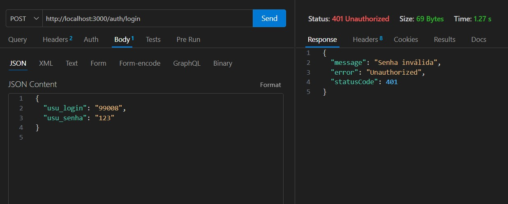

---

# 2. Funcionários

## CT-FUNC-001 - Cadastro de funcionário

...

### Evidência

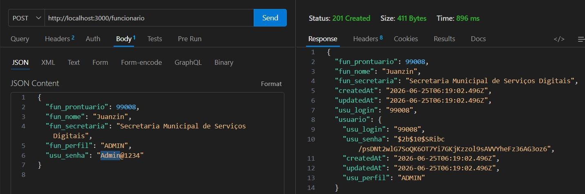

---

## CT-FUNC-002 - Listagem de funcionários

...

### Evidência

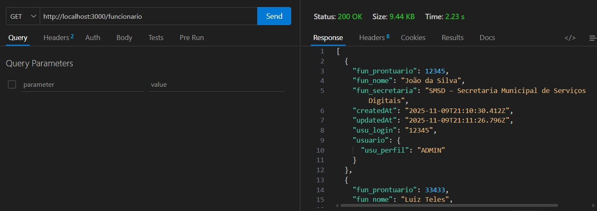

---

## CT-FUNC-003 - Atualização de funcionário

...

### Evidência

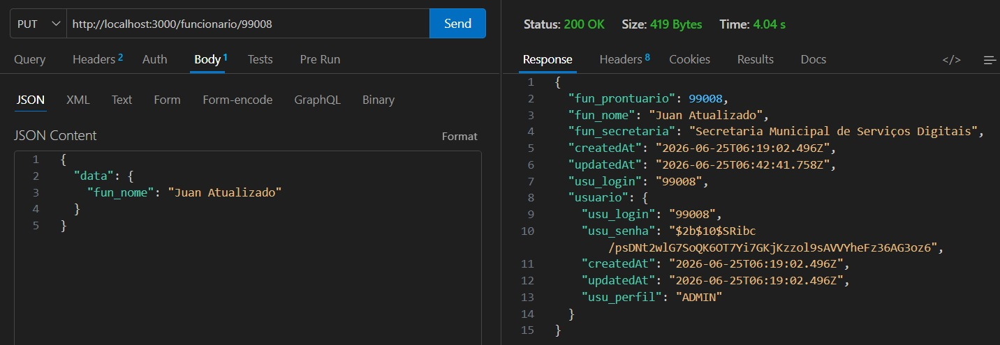

---

# 3. Motoristas

## CT-MOT-001 - Cadastro de motorista

...

### Evidência

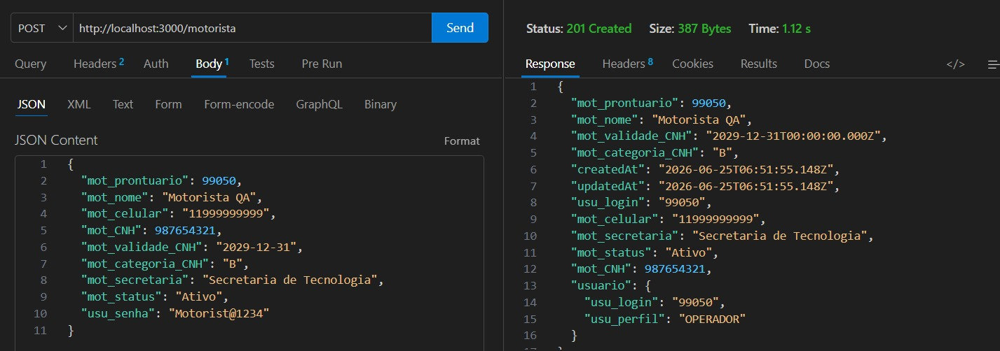

---

## CT-MOT-002 - Listagem de motoristas

...

### Evidência

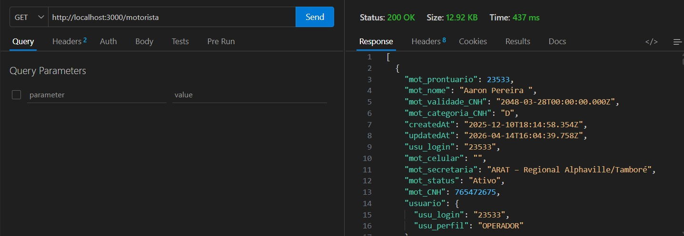

---

## CT-MOT-003 - Cadastro com prontuário duplicado

...

### Evidência

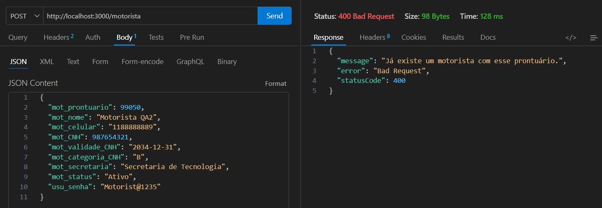

---

# 4. Veículos

## CT-VEI-001 - Cadastro de veículo

...

### Evidência

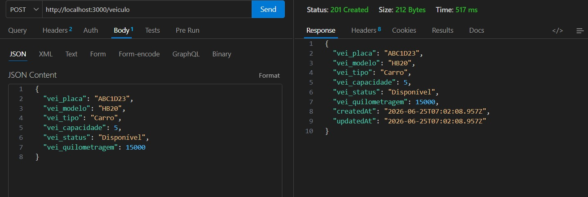

---

## CT-VEI-002 - Listagem de veículos

...

### Evidência

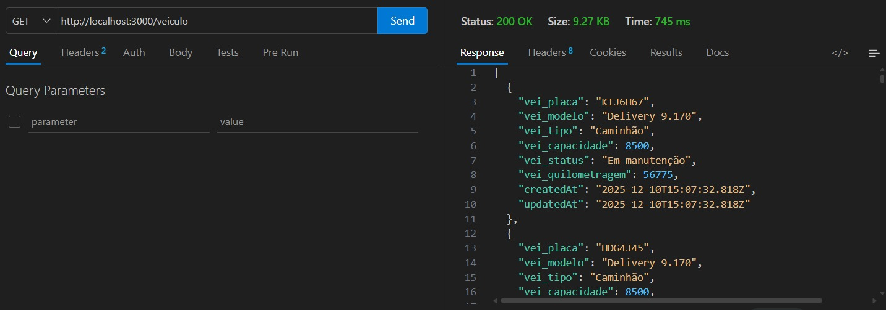

---

## CT-VEI-003 - Cadastro com placa duplicada

...

### Evidência

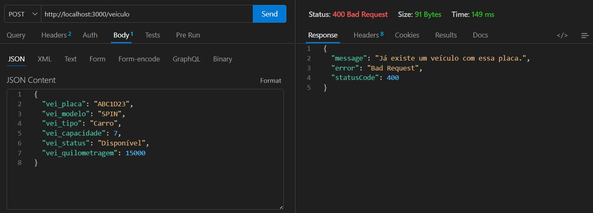

---

# 5. Corridas

## CT-COR-001 - Criação de solicitação de corrida

...

### Evidência

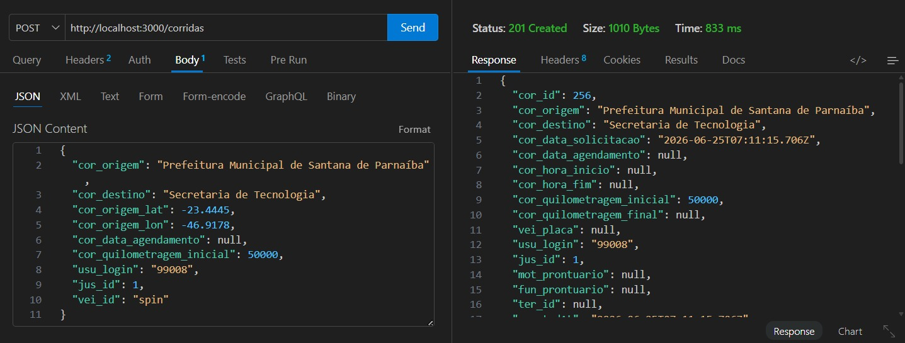

---

# Considerações Finais

Os casos de teste documentados neste arquivo representam a execução manual dos principais fluxos da API do sistema EMoov.

As evidências foram registradas por meio do Thunder Client e organizadas por módulo no repositório.
